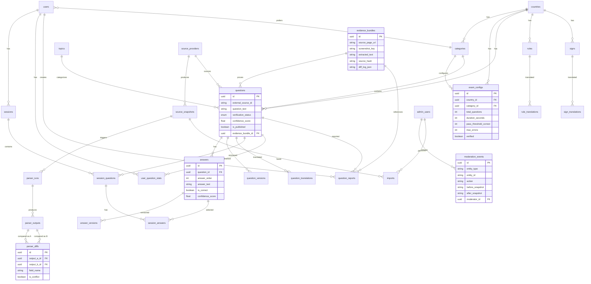

# Entity Relationship Diagram

```mermaid
erDiagram
    users ||--o{ sessions : has
    users ||--o{ user_question_stats : has
    users ||--o{ question_reports : creates
    users }o--|| categories : prefers

    countries ||--o{ categories : has
    countries ||--o{ exam_configs : has
    countries ||--o{ questions : has
    countries ||--o{ rules : has
    countries ||--o{ signs : has

    categories ||--o{ exam_configs : configures
    categories ||--o{ questions : contains

    topics ||--o{ questions : categorizes

    source_providers ||--o{ source_snapshots : produces
    source_providers ||--o{ questions : sources

    source_snapshots ||--o{ parser_runs : triggers
    source_snapshots ||--o{ imports : feeds

    parser_runs ||--o{ parser_outputs : produces

    parser_outputs ||--o{ parser_diffs : "compared as A"
    parser_outputs ||--o{ parser_diffs : "compared as B"

    evidence_bundles ||--o{ questions : proves
    evidence_bundles ||--o{ question_reports : references

    questions ||--o{ answers : has
    questions ||--o{ question_versions : versioned
    questions ||--o{ question_translations : translated
    questions ||--o{ session_questions : used_in
    questions ||--o{ user_question_stats : tracked
    questions ||--o{ question_reports : reported

    answers ||--o{ answer_versions : versioned
    answers ||--o{ session_answers : selected

    sessions ||--o{ session_questions : contains
    session_questions ||--o{ session_answers : has

    rules ||--o{ rule_translations : translated
    signs ||--o{ sign_translations : translated

    admin_users ||--o{ moderation_events : performs
    admin_users ||--o{ imports : initiates

    questions {
        uuid id PK
        string external_source_id
        string question_text
        enum verification_status
        float confidence_score
        boolean is_published
        uuid evidence_bundle_id FK
    }

    answers {
        uuid id PK
        uuid question_id FK
        int answer_order
        string answer_text
        boolean is_correct
        float confidence_score
    }

    exam_configs {
        uuid id PK
        uuid country_id FK
        uuid category_id FK
        int total_questions
        int duration_seconds
        int pass_threshold_correct
        int max_errors
        boolean verified
    }

    evidence_bundles {
        uuid id PK
        string source_page_url
        string screenshot_key
        string extracted_text
        string source_hash
        string diff_log_json
    }

    moderation_events {
        uuid id PK
        string entity_type
        string entity_id
        string action
        string before_snapshot
        string after_snapshot
        uuid moderator_id FK
    }

    parser_diffs {
        uuid id PK
        uuid output_a_id FK
        uuid output_b_id FK
        string field_name
        boolean is_conflict
    }
```
